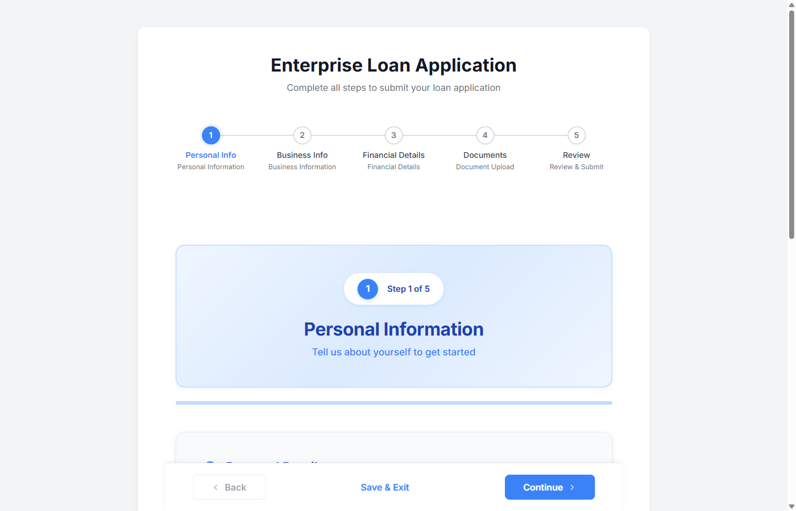

<div align="center">

# Enterprise Loan Wizard

### A 5-step loan application wizard built for the Australian market

Multi-step form with real-time validation, auto-save, Australian TFN/ABN masking, and PDF receipt generation.

[](https://enterprise-loan-wizard.vercel.app)

[](https://angular.dev/)
[](https://www.typescriptlang.org/)
[](https://sass-lang.com/)
[](https://jestjs.io/)

</div>

---

<div align="center">
  
</div>

---

## The 5 Steps

| Step | What's Collected |
|:-----|:-----------------|
| **1. Personal Info** | Name, email, phone, DOB (18+ check), TFN (9-digit masked), full Australian address |
| **2. Business Info** | Business name, type, ABN (11-digit masked), industry, revenue, employees, optional separate address |
| **3. Financial Details** | Loan amount (min $1,000), purpose, term, monthly revenue/expenses, credit score, optional collateral |
| **4. Documents** | Government ID (1+), business registration (1+), bank statements (3+), tax returns (2+) |
| **5. Review & Submit** | Read-only summary with masked TFN/ABN, three consent checkboxes, PDF receipt on submit |

---

## Tech Stack

| Layer | Technology |
|:------|:-----------|
| **Framework** | Angular 20 (Standalone Components) |
| **Language** | TypeScript 5.8 (strict mode) |
| **State** | Angular Signals + RxJS BehaviorSubject + localStorage |
| **Forms** | Angular Reactive Forms (FormBuilder) |
| **Input Masking** | ngx-mask 20 (TFN, ABN, phone, postcode) |
| **PDF** | jsPDF 3 (multi-page receipts with masked sensitive data) |
| **Animations** | Angular Animations (fade-in transitions between steps) |
| **Styling** | SCSS with CSS Variables — custom design system, no frameworks |
| **Testing** | Jest 30 + jest-preset-angular 16 |
| **Deployment** | Vercel (security headers via vercel.json) |

---

## Key Features

| Feature | Details |
|:--------|:--------|
| **Auto-Save** | Saves to localStorage every 30 seconds with 7-day expiration |
| **Real-Time Validation** | Field-level errors on blur, step-level validation on continue |
| **Conditional Fields** | "Same as personal address" toggle, "Has collateral" toggle |
| **Input Masking** | TFN: `000 000 000`, ABN: `00 000 000 000`, Phone: `0000 000 000` |
| **PDF Receipt** | Multi-page PDF with masked sensitive data, generated client-side |
| **Progress Tracking** | Visual stepper with completed/current/upcoming states |
| **Australian Locale** | AUD currency, AU states, 4-digit postcodes, AU date format |
| **Responsive** | Mobile-first, touch-friendly (44px min targets), 16px inputs |

---

## Architecture

```
Container-Presenter Pattern
───────────────────────────

Wizard (container)          ← Orchestrates state, navigation, submission
├── ProgressStepper         ← Visual step indicator (completed/active/upcoming)
├── Step Components         ← Presentational: render forms, emit data
│   ├── PersonalInfo
│   ├── BusinessInfo
│   ├── FinancialDetails
│   ├── DocumentUpload
│   └── ReviewSubmit
└── NavigationFooter        ← Back/Next/Submit with conditional visibility

State: WizardState Service (428 lines)
├── Angular Signals         → currentStep, isFirstStep, isLastStep, progress
├── RxJS BehaviorSubject    → formData$ (complex form data stream)
└── localStorage            → persistence (30s auto-save, 7-day expiry)
```

---

## Project Structure

```
src/app/
├── components/
│   ├── wizard/                 Container component (orchestrator)
│   ├── progress-stepper/       Visual step indicator
│   ├── navigation-footer/      Back / Next / Submit buttons
│   ├── success-screen/         Post-submission + PDF download
│   └── steps/
│       ├── personal-info/      Step 1
│       ├── business-info/      Step 2
│       ├── financial-details/  Step 3
│       ├── document-upload/    Step 4
│       └── review-submit/      Step 5
├── services/
│   └── wizard-state.ts         Centralized state (Signals + RxJS + localStorage)
├── constants/
│   ├── australian-data.ts      Shared AU states, country data
│   └── wizard-config.ts        Auto-save interval, storage keys, min file counts
└── utils/
    └── formatting.ts           Currency (AUD), date, TFN/ABN masking
```

---

## Testing

**332 tests** across 10 spec files covering the full wizard lifecycle.

```bash
npm test                 # run all tests
npm run test:coverage    # with coverage report
```

| File | Tests | Coverage |
|:-----|------:|:---------|
| wizard-state.spec | ~128 | State, navigation, persistence, auto-save, validation, submission |
| personal-info.spec | ~40 | Form validation, age check, TFN masking, AU formats |
| business-info.spec | ~35 | Conditional address validation, ABN, shared states |
| financial-details.spec | ~30 | Loan min, collateral toggle, dropdown options |
| document-upload.spec | ~35 | File add/remove, min counts, file size formatting |
| review-submit.spec | ~25 | Checkboxes (requiredTrue), masking methods |
| navigation-footer.spec | ~24 | Button states, event emission, disabled logic |
| success-screen.spec | ~22 | PDF mock, localStorage, error handling, cleanup |
| progress-stepper.spec | ~32 | Step status, clickability, edge cases |
| app.spec | 2 | Root component rendering |

---

## Getting Started

```bash
git clone https://github.com/Rohit23SR/enterprise-loan-wizard.git
cd enterprise-loan-wizard
npm install
npm start                # http://localhost:4200
```

No backend required — submission is simulated client-side. All data stays in the browser.

---

## Scripts

| Command | Description |
|:--------|:------------|
| `npm start` | Dev server (ng serve) |
| `npm run build` | Production build |
| `npm test` | Run all 332 tests |
| `npm run test:coverage` | Coverage report |
| `npm run lint` | ESLint check |
| `npm run format` | Prettier format |

---

## Security Headers (Vercel)

```
X-Content-Type-Options:    nosniff
X-Frame-Options:           DENY
X-XSS-Protection:          1; mode=block
Referrer-Policy:           strict-origin-when-cross-origin
Strict-Transport-Security: max-age=31536000
Content-Security-Policy:   configured
```

---

## License

Private and proprietary.
